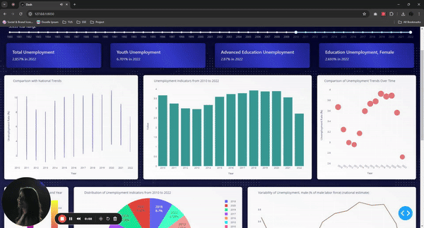
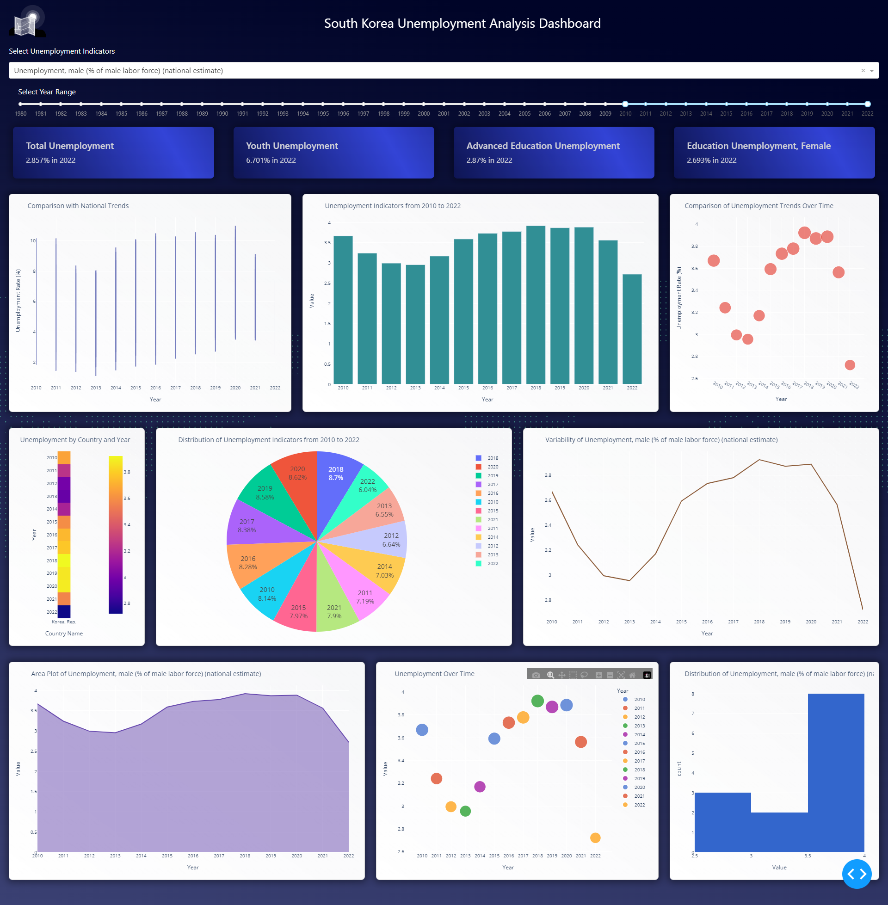

# South Korea Unemployment Analysis Dashboard

This dashboard provides an analysis of unemployment indicators for South Korea. It visualizes various unemployment-related metrics over time and compares them with global or regional trends.

## Table of Contents

- [South Korea Unemployment Analysis Dashboard](#south-korea-unemployment-analysis-dashboard)
  - [Table of Contents](#table-of-contents)
  - [Introduction](#introduction)
  - [Technologies Used](#technologies-used)
  - [Getting Started](#getting-started)
    - [Prerequisites](#prerequisites)
    - [Installation](#installation)
    - [Running the Dashboard](#running-the-dashboard)
  - [Features](#features)
  - [How to Use](#how-to-use)
  - [Graphs and Indicators](#graphs-and-indicators)
  - [Data Source](#data-source)
  - [Technical Details](#technical-details)
  - [Contributing](#contributing)
  - [License](#license)
  - [Troubleshooting](#troubleshooting)
    - [The dashboard is not loading; what should I do?](#the-dashboard-is-not-loading-what-should-i-do)
    - [I encounter a 'Data Not Found' message when selecting certain years. Why?](#i-encounter-a-data-not-found-message-when-selecting-certain-years-why)
  - [Future Enhancements](#future-enhancements)
  - [Case Studies](#case-studies)
  - [Acknowledgments](#acknowledgments)
  - [Contact Information](#contact-information)
  - [Screengif](#screengif)
  - [Screengrab](#screengrab)

## Introduction

This Dash web application allows users to:

- Select unemployment indicators of interest.
- Choose a range of years to analyze.
- View key unemployment indicators for South Korea.
- Visualize unemployment trends over time through various plots and charts.

## Technologies Used

- **Python**: For backend logic and data manipulation.
- **Dash by Plotly**: A Python web application framework used for building analytical web applications.
- **Plotly**: Used for creating the interactive graphs.
- **Pandas**: Employed for data manipulation and analysis.

## Getting Started

To run this dashboard locally, you need Python and several libraries installed on your system. Follow these steps to set up and start the server:

### Prerequisites

- Python 3.6 or higher
- pip (Python package installer)

### Installation

1. **Clone the Repository**
   ```bash
   git clone https://github.com/your-username/south-korea-unemployment-dashboard.git
   cd south-korea-unemployment-dashboard
   ```

2. **Install Required Libraries**
   ```bash
   pip install -r requirements.txt
   ```

### Running the Dashboard

1. **Start the Dash Server**
   ```bash
   python economic-dashboard.py
   ```

2. **Access the Dashboard**
   - Open your web browser and visit `http://127.0.0.1:8050/`

## Features

- **Navbar**: Includes a logo and the name of the dashboard.
- **Dropdown and Range Slider**: Allows users to select unemployment indicators and specify the year range.
- **Key Indicators**: Displays key unemployment indicators for South Korea.
- **Interactive Charts and Graphs**: Visualize unemployment data through dynamic, interactive means.
- **Customizable Views**: Select specific indicators and time frames to tailor the data display to your needs.
- **Responsive Design**: Compatible with both desktop and mobile devices, ensuring accessibility and ease of use.
- - **Animated Background**: Features a subtle, animated world map in the background, enhancing the visual appeal and emphasizing the global context of the data.

## How to Use

- **Select Indicators**: Choose specific unemployment indicators from the dropdown menu.
- **Adjust Year Range**: Modify the time frame via the range slider to focus on particular years.
- **Graph Interaction**: Click and hover over graph elements to unveil more detailed data.
- **Navigation**: Effortlessly scroll to view various data visualizations throughout the dashboard.

## Graphs and Indicators

Each graph provides a different perspective on the unemployment data:

- **Total Unemployment Line Graph**: Tracks the unemployment rate over time, providing a clear view of trends and fluctuations.
- **Youth Unemployment Bar Chart**:  Compares the unemployment rate among young individuals across different years.
- **Advanced Education Unemployment Scatter Plot**: Analyzes the relationship between unemployment and education level, with the size of the scatter points reflecting the intensity of unemployment rates.
- **Female Education Unemployment Pie Chart**: Breaks down unemployment rates among women with different education levels, showing the proportion of each group.
- **Line Chart of Variability**: Illustrates the changes in unemployment rates over time, emphasizing the volatility in the job market.
- **Area Plot**: Highlights the distribution and density of unemployment rates, giving a sense of the data's spread over time.
- **Heatmap**: Offers a color-coded view of unemployment rates by year and demographic group, making it easy to spot patterns.
- **Bubble Chart**: Combines aspects of the scatter plot and area plot to depict unemployment rates, where the bubble size represents the magnitude.

## Data Source

The data visualized in this dashboard is sourced from the [World Bank's Data Repository](https://data.worldbank.org/country/KR), which provides comprehensive economic, social, and developmental statistics.

## Technical Details

- **Framework**: Developed using Dash by Plotly.
- **Data Processing**: Implemented with Pandas for efficient data manipulation and analysis.
- **Styling**: Enhanced with Dash Bootstrap Components and custom CSS.

## Contributing

Contributions are welcome! For major changes, please open an issue first to discuss what you would like to change.

## License

This project is licensed under the MIT License - see the [LICENSE](LICENSE.md) file for details.


## Troubleshooting

### The dashboard is not loading; what should I do?
Ensure that your internet connection is stable. If the problem persists, try refreshing the page or clearing your browser's cache.

### I encounter a 'Data Not Found' message when selecting certain years. Why?
This issue typically occurs if the selected year does not have available data. Try choosing a different range or check the data source for data availability.

## Future Enhancements

- **Real-Time Data Updates**: Integration with real-time data sources for more current unemployment stats.
- **Multilingual Support**: To make the dashboard accessible to a broader audience, adding support for other languages is planned.
- **Advanced Analytics Features**: Introducing predictive analytics and trend analysis tools.


## Case Studies

**Case Study 1: Economic Research**
In 2021, a group of economic researchers used this dashboard to identify trends in youth unemployment, contributing to a published paper on economic impacts in South Korea.

## Acknowledgments

Special thanks to the [World Bank](https://data.worldbank.org/) for providing the data used in this dashboard.

## Contact Information

For more information or support, please contact us at [singh.kajal940@gmail.com](mailto:singh.kajal940@gmail.com).


## Screengif
[Watch the Video](assets/dashboard.mp4)




## Screengrab
[Dashboard Screen Grab](assets/dashboard-screengrab.png)

